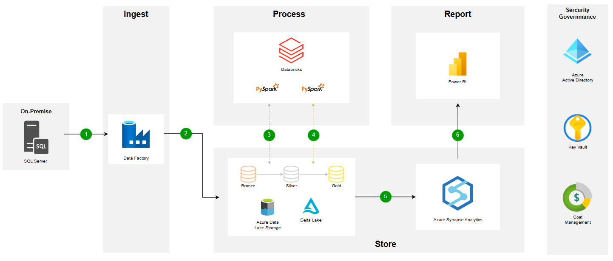

# [Building Data Lake on the Microsoft Azure Cloud Platform](hhttps://github.com/trannhatnguyen2/BI_DataLake_Azure)

## Member of group

| student_id | class   | full_name        |
| ---------- | ------- | ---------------- |
| K204061440 | K20406T | Tran Nhat Nguyen |

# 📕 Table of contents

- 🛠️ [Tools](#️-tools)
- 🚀 [Solution](#-solution)

 

# 🛠️ Tools

| Tools                        |
| ---------------------------- |
| SQL Server                   |
| Azure Data Factory           |
| Azure Data Lake Storage Gen2 |
| Azure Databricks             |
| Azure Synapse Analytics      |
| Azure Key Vault              |
| Azure Active Directory       |
| Microsoft Power BI           |

# 🚀 Solution

    Solution

The use case for this project is building an end-to-end solution by ingesting the tables from the on-premise SQL Server database using Azure Data Factory and then storing the data in Azure Data Lake Storage Gen2. Then Azure Databricks is used to transform the RAW data to the cleanest form of data and then we use Azure Synapse Analytics to load the clean data and finally use Microsoft Power BI to integrate with Azure Synapse Analytics to build an interactive dashboard. Also, we are using Azure Active Directory and Azure Key Vault for monitoring and governance purposes.

---

&copy; 2023 NhatNguyen

